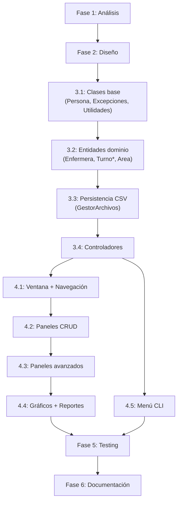

# Plan de Trabajo — Sistema de Gestión de Turnos de Enfermeras

---

## Resumen Ejecutivo

Este plan detalla el desarrollo del **Sistema de Gestión de Turnos de Enfermeras** replicando la arquitectura, convenciones y calidad del proyecto anterior (Asistencia Escolar). El sistema gestionará la asignación de turnos hospitalarios considerando disponibilidad, preferencias y necesidades por área, con funcionalidades de cambio de turno, visualización de horarios y reportes de asistencia. Se mantiene el stack Java 11 + Maven + Swing + CSV, la doble interfaz CLI/GUI, MVC con controladores activos, y todas las convenciones de código en español. El plan se estructura en **6 fases** con un estimado de **8–12 semanas** de desarrollo.

---

## Mapeo de Dominio: Proyecto Anterior → Proyecto Nuevo

| Concepto Anterior | Concepto Nuevo | Notas |
|:---|:---|:---|
| `Estudiante` | `Enfermera` | Persona con datos profesionales en vez de escolares |
| `Asistencia` (abstracta) | `Turno` (abstracta) | Registro polimórfico con subtipos |
| `AsistenciaNormal` | `TurnoRegular` | Turno estándar (mañana/tarde/noche) |
| `InasistenciaExtraordinaria` | `Licencia` | Ausencia justificada (médica, personal, etc.) |
| `SalidaAnticipada` | `CambioTurno` | Intercambio entre enfermeras |
| `Curso` | `AreaHospitalaria` | Agrupación (UCI, Urgencias, Pediatría, etc.) |
| `RUT` (clave primaria) | `RUT` (se mantiene, contexto chileno) |
| `listaGlobal` (TreeMap) | `registroGlobal` (TreeMap) | Misma estructura RUT → Enfermera |
| `GestorArchivos` | `GestorArchivos` | Misma persistencia CSV |
| Umbral 85% asistencia | Cumplimiento de horas mínimas/mes | Adaptado a turnos |
| Gráfico de barras por curso | Gráfico de barras por área | Cobertura por área |
| Gráfico de torta por alumno | Gráfico de torta por enfermera | Distribución de tipos de turno |

---

## Fase 1: Análisis y Definición de Requisitos

**Duración estimada:** 1–2 semanas  
**Objetivo:** Definir completamente el dominio, entidades, reglas de negocio y alcance funcional.

### Tarea 1.1 — Definir Entidades del Dominio

**Descripción:** Documentar todas las entidades, atributos y relaciones del sistema.

**Entregable:** Documento de entidades con los siguientes modelos propuestos:

```
Persona (clase base)
├── nombre, apellidoP, apellidoM, rut, edad
└── validarRut() ← reutilizar Módulo 11

Enfermera (extends Persona)
├── especialidad : String
├── areaAsignada : String
├── disponibilidad : Map<String, List<String>>  ← día → horarios disponibles
├── listaTurnos : ArrayList<Turno>
└── preferencias : List<String>  ← turnos preferidos (Mañana/Tarde/Noche)

Turno (abstract)
├── id : String (UUID 8 chars)
├── fecha : String (DD/MM/AAAA)
├── horaInicio : String (HH:MM)
├── horaFin : String (HH:MM)
├── observacion : String
└── abstract getResumen() : String

TurnoRegular (extends Turno)
├── tipoTurno : String  ← "Mañana" / "Tarde" / "Noche"
└── getResumen()

Licencia (extends Turno)
├── motivo : String
├── tipoLicencia : String  ← "Médica" / "Personal" / "Maternidad" / "Otro"
└── getResumen()

CambioTurno (extends Turno)
├── rutEnfermeraSustituta : String
├── motivoCambio : String
└── getResumen()

AreaHospitalaria
├── nombre : String
├── enfermeras : TreeMap<String, Enfermera>
├── minimoEnfermeras : int  ← requisito mínimo de cobertura
└── poblarArea(), generarLista(), verificarCobertura()
```

**Criterios de aceptación:**
- [ ] Todas las entidades tienen atributos definidos con tipos de datos
- [ ] Las relaciones de herencia están documentadas
- [ ] Las reglas de negocio están identificadas

### Tarea 1.2 — Definir Reglas de Negocio

**Descripción:** Documentar restricciones, validaciones y reglas operativas.

**Reglas propuestas:**

| Regla | Descripción | Implementación |
|:---|:---|:---|
| **RB-01** | Cada turno tiene duración fija (Mañana: 07:00–15:00, Tarde: 15:00–23:00, Noche: 23:00–07:00) | Constantes en clase `Utilidades` |
| **RB-02** | Una enfermera no puede tener dos turnos superpuestos el mismo día | Validación en `Enfermera.agregarTurno()` |
| **RB-03** | Cada área debe tener un mínimo de enfermeras por turno | Validación en `AreaHospitalaria.verificarCobertura()` |
| **RB-04** | Un cambio de turno requiere que la sustituta esté disponible | Validación en `CambioTurno` |
| **RB-05** | Las licencias médicas deben registrar duración y motivo | Campos obligatorios en `Licencia` |
| **RB-06** | RUT validado con Módulo 11 (reutilizar exactamente de `Persona`) | `Persona.validarRut()` |
| **RB-07** | Reportes de asistencia calculan horas trabajadas vs. horas programadas | Método en `Enfermera` |

### Tarea 1.3 — Definir Requisitos Funcionales

**Entregable:** Lista de funcionalidades con prioridad.

| ID | Funcionalidad | Prioridad | Referencia anterior |
|:---|:---|:---|:---|
| RF-01 | CRUD de enfermeras | Alta | Igual a CRUD de estudiantes |
| RF-02 | Asignación de turnos (individual) | Alta | Similar a registrar asistencia |
| RF-03 | Asignación de turnos grupal por área | Alta | Similar a asistencia grupal |
| RF-04 | Gestión de cambios de turno | Alta | Nuevo |
| RF-05 | Registro de licencias | Alta | Similar a inasistencias |
| RF-06 | Visualización de horario semanal/mensual | Media | Nuevo |
| RF-07 | Estadísticas por enfermera (horas, tipos) | Media | Similar a estadísticas estudiante |
| RF-08 | Resumen por área hospitalaria | Media | Similar a resumen por curso |
| RF-09 | Gráfico de barras de cobertura por área | Media | Similar a gráfico de curso |
| RF-10 | Gráfico de torta de distribución de turnos | Media | Similar a gráfico estudiante |
| RF-11 | Exportar horario/resumen a CSV | Baja | Similar a exportar curso |
| RF-12 | Alertas de cobertura insuficiente | Baja | Similar a alerta < 85% |

### Checklist de Fase 1

- [ ] Entidades del dominio documentadas con atributos y tipos
- [ ] Reglas de negocio numeradas y descritas
- [ ] Requisitos funcionales priorizados
- [ ] Mapeo completo desde proyecto anterior validado
- [ ] Preguntas pendientes resueltas con el usuario

---

## Fase 2: Diseño de Arquitectura

**Duración estimada:** 1 semana  
**Objetivo:** Diseñar la estructura de paquetes, CSV, UI y diagrama de clases respetando las convenciones del proyecto anterior.

### Tarea 2.1 — Estructura de Paquetes

```
TurnosEnfermeria/
├── Main.java
├── modelo/
│   ├── Persona.java              ← Reutilizar íntegra (con validarRut)
│   ├── Enfermera.java            ← extends Persona
│   ├── Turno.java                ← abstract, getResumen()
│   ├── TurnoRegular.java         ← extends Turno
│   ├── Licencia.java             ← extends Turno
│   ├── CambioTurno.java          ← extends Turno
│   ├── AreaHospitalaria.java
│   ├── GestorArchivos.java
│   ├── Utilidades.java
│   ├── RutInvalidoException.java          ← Reutilizar
│   ├── EdadInvalidaException.java         ← Reutilizar
│   ├── EnfermeraNoEncontradaException.java ← Adaptar nombre
│   └── TurnoConflictoException.java       ← Nueva
├── controlador/                   ← ESTA VEZ, USAR REALMENTE
│   ├── EnfermeraControlador.java
│   ├── TurnoControlador.java
│   └── AreaControlador.java
└── vista/
    ├── Ventana.java               ← CardLayout + Stack (reutilizar patrón)
    ├── Menu.java
    ├── IngresoEnfermera.java
    ├── PanelGestionEnfermeras.java
    ├── PanelTurnos.java
    ├── PanelAsignacionGrupal.java
    ├── PanelEstadisticasEnfermera.java
    ├── PanelHorarioSemanal.java   ← Nuevo: vista tipo calendario
    ├── PanelGraficoArea.java
    ├── PanelGraficoEnfermera.java
    └── PanelResumenArea.java
```

### Tarea 2.2 — Diseñar Formato CSV

#### `enfermeras.csv`
```
RUT;Nombre;ApellidoPaterno;ApellidoMaterno;Edad;Especialidad;Area
12345678-5;María;González;Rojas;32;Enfermería General;UCI
```

#### `turnos.csv`
```
RUT;TIPO;ID;FECHA;HORA_INICIO;HORA_FIN;OBSERVACION;CAMPO_ESPECIFICO
12345678-5;REGULAR;A001;06/09/2026;07:00;15:00;Sin novedad;Mañana
12345678-5;LICENCIA;A002;07/09/2026;07:00;15:00;Reposo;Médica
12345678-5;CAMBIO;A003;08/09/2026;15:00;23:00;Intercambio;11111111-1|Motivo personal
```

### Tarea 2.3 — Diseñar Paleta UI

Mantener el esquema de colores del proyecto anterior con adaptaciones hospitalarias:

| Elemento | Color | Hex |
|:---|:---|:---|
| Header/Barra superior | Azul hospitalario oscuro | `#1B4965` |
| Fondo general | Gris claro limpio | `#F0F4F8` |
| Botones primarios | Azul médico | `#5A9BD5` |
| Alerta positiva (cobertura OK) | Verde | `#00823C` |
| Alerta negativa (cobertura baja) | Rojo | `#B41E1E` |
| Turno Mañana | Amarillo suave | `#F4D35E` |
| Turno Tarde | Naranja | `#EE964B` |
| Turno Noche | Azul oscuro | `#2C3E50` |

### Checklist de Fase 2

- [ ] Estructura de paquetes definida con todos los archivos
- [ ] Formatos CSV documentados con ejemplos
- [ ] Diagrama de clases UML completo
- [ ] Paleta de colores definida
- [ ] Todos los paneles GUI planificados con wireframes básicos
- [ ] Controladores diseñados para ser **realmente utilizados** por las vistas

---

## Fase 3: Implementación del Modelo

**Duración estimada:** 2–3 semanas  
**Objetivo:** Implementar todas las clases del paquete `modelo/` con testing unitario.

### Tarea 3.1 — Clases Base Reutilizables

**Entregables:** `Persona.java`, excepciones, `Utilidades.java`

- [ ] Copiar `Persona.java` íntegramente (con `validarRut` Módulo 11)
- [ ] Copiar `RutInvalidoException.java`, `EdadInvalidaException.java`
- [ ] Crear `EnfermeraNoEncontradaException.java` (adaptar de `EstudianteNoEncontradoException`)
- [ ] Crear `TurnoConflictoException.java` (nueva excepción checked)
- [ ] Adaptar `Utilidades.java` (agregar validación de horas `HH:MM`, mantener `validarFecha`)

### Tarea 3.2 — Entidades del Dominio

**Entregables:** `Enfermera.java`, `Turno.java`, subtipos, `AreaHospitalaria.java`

- [ ] `Enfermera extends Persona` con campos de especialidad, área, disponibilidad, turnos
- [ ] `Turno` abstracto con `getResumen()` polimórfico
- [ ] `TurnoRegular`, `Licencia`, `CambioTurno` como subclases concretas
- [ ] `AreaHospitalaria` con `TreeMap<String, Enfermera>`, mínimo de cobertura, métodos de validación
- [ ] Encapsulación defensiva: `Collections.unmodifiableList()` en getters, copias defensivas en setters
- [ ] Validación de conflictos de turno en `Enfermera.agregarTurno()`

### Tarea 3.3 — Persistencia CSV

**Entregable:** `GestorArchivos.java`

- [ ] `cargarEnfermeras()` con fallback a datos semilla
- [ ] `guardarEnfermeras()` con creación de carpeta `resources/`
- [ ] `cargarTurnos()` con deserialización polimórfica por tipo
- [ ] `guardarTurnos()` con serialización por `instanceof`
- [ ] `cargarDatosIniciales()` con al menos 5 enfermeras y turnos de ejemplo
- [ ] Manejo de errores: `System.err` + skip en CSV, nunca terminar ejecución

### Tarea 3.4 — Controladores (REALMENTE usados esta vez)

**Entregables:** `EnfermeraControlador.java`, `TurnoControlador.java`, `AreaControlador.java`

> [!IMPORTANT]
> A diferencia del proyecto anterior donde los controladores existían pero nunca se invocaban desde las vistas, en este proyecto **las vistas DEBEN usar los controladores como intermediarios**. Ninguna vista debe acceder directamente a `Main.registroGlobal`.

- [ ] `EnfermeraControlador`: `obtener()`, `agregar()`, `eliminar()`, `listar()`, `editar()`
- [ ] `TurnoControlador`: `registrar()`, `eliminar()`, `buscar()`, `calcularHoras()`, `verificarConflicto()`
- [ ] `AreaControlador`: `obtenerArea()`, `verificarCobertura()`, `listarPorArea()`

### Checklist de Fase 3

- [ ] Todas las clases compilan sin errores
- [ ] Excepciones personalizadas con metadata (campo getter)
- [ ] `Collections.unmodifiableList/Map` en todos los getters de colecciones
- [ ] Copias defensivas en todos los setters de colecciones
- [ ] Nomenclatura 100% en español (camelCase para métodos/variables, PascalCase para clases)
- [ ] Javadoc en todas las clases y métodos públicos
- [ ] Controladores realmente intermedian entre Vista y Modelo
- [ ] Datos semilla generan al menos 5 enfermeras con turnos variados
- [ ] Sin dependencias Maven no utilizadas

---

## Fase 4: Implementación de Vistas y CLI

**Duración estimada:** 2–3 semanas  
**Objetivo:** Implementar la interfaz gráfica Swing y el menú de consola.

### Tarea 4.1 — Ventana Principal y Navegación

- [ ] `Ventana.java` con `CardLayout` + `Stack<String>` (reutilizar patrón exacto)
- [ ] Registrar **TODOS** los paneles en el `CardLayout` (no repetir bug del proyecto anterior)
- [ ] `Menu.java` con botones estilizados (paleta hospitalaria)
- [ ] Hook `windowClosing` para guardar datos al cerrar

### Tarea 4.2 — Paneles CRUD

- [ ] `IngresoEnfermera.java`: formulario con validación, `JComboBox` para área y especialidad
- [ ] `PanelGestionEnfermeras.java`: `JTable` con búsqueda, edición, eliminación
- [ ] `PanelTurnos.java`: gestión de turnos por RUT, registro con diálogos tipo-específicos

### Tarea 4.3 — Paneles de Funcionalidad Avanzada

- [ ] `PanelAsignacionGrupal.java`: asignación de turnos por área con checkboxes
- [ ] `PanelHorarioSemanal.java`: **NUEVO** — vista tipo grilla/calendario semanal con colores por tipo de turno
- [ ] `PanelEstadisticasEnfermera.java`: horas trabajadas, distribución de turnos, alertas

### Tarea 4.4 — Paneles de Gráficos y Reportes

- [ ] `PanelGraficoArea.java`: barras de cobertura por área (Java2D, sin JFreeChart)
- [ ] `PanelGraficoEnfermera.java`: torta de distribución de tipos de turno (Java2D)
- [ ] `PanelResumenArea.java`: tabla resumen con `TableRowSorter` + exportar a CSV

### Tarea 4.5 — Menú CLI

- [ ] Menú numerado con todas las operaciones (reutilizar estructura del anterior)
- [ ] Selector de modo al inicio (GUI / Consola)

### Checklist de Fase 4

- [ ] Todos los paneles registrados en `CardLayout` (verificar exhaustivamente)
- [ ] Ninguna vista accede directamente a `Main.registroGlobal` — todo vía Controladores
- [ ] `JOptionPane` para errores con `requestFocus()` al campo inválido
- [ ] Tablas con `DefaultTableModel` no editable y `TableRowSorter`
- [ ] Paleta de colores consistente con la definida en Fase 2
- [ ] No duplicar validaciones — usar `Utilidades` centralizado
- [ ] Gráficos renderizados con Java2D, sin dependencias externas

---

## Fase 5: Testing e Integración

**Duración estimada:** 1–2 semanas  
**Objetivo:** Verificar funcionalidad completa, persistencia y flujo de datos.

### Tarea 5.1 — Testing Funcional

- [ ] CRUD completo de enfermeras (consola + GUI)
- [ ] Registro de turnos de cada tipo (regular, licencia, cambio)
- [ ] Asignación grupal por área
- [ ] Persistencia: cerrar y reabrir, verificar que datos persisten
- [ ] Validación de RUT (válidos e inválidos)
- [ ] Conflicto de turnos (misma enfermera, mismo horario)

### Tarea 5.2 — Testing de Datos Semilla

- [ ] Eliminar `resources/` y verificar que se regeneran datos iniciales
- [ ] Verificar que datos semilla cubren al menos 3 áreas y 5 enfermeras
- [ ] Verificar que todos los tipos de turno están representados en datos semilla

### Tarea 5.3 — Testing de Edge Cases

- [ ] CSV corrupto o con formato incorrecto (no debe crashear)
- [ ] RUT duplicado (manejar graciosamente)
- [ ] Turno en fecha inválida
- [ ] Área sin enfermeras asignadas
- [ ] Cambio de turno con enfermera sustituta no encontrada

### Tarea 5.4 — Revisión de Código

- [ ] Verificar que no hay código muerto ni comentado
- [ ] Verificar que no hay imports no utilizados
- [ ] Verificar que no hay dependencias Maven fantasma en `pom.xml`
- [ ] Verificar que todas las rutas en scripts `.sh`/`.bat` manejan espacios

### Checklist de Fase 5

- [ ] Todos los flujos funcionales probados en ambas interfaces
- [ ] Persistencia verificada con ciclo completo guardar-cargar
- [ ] Edge cases documentados y manejados
- [ ] Código limpio sin dead code, imports fantasma ni dependencias no usadas

---

## Fase 6: Documentación y Entrega

**Duración estimada:** 1 semana  
**Objetivo:** Documentar el proyecto para entrega académica.

### Tarea 6.1 — Documentación de Código

- [ ] Javadoc completo en todas las clases y métodos públicos
- [ ] Comentarios `// CAMBIO N:` donde aplique evolución iterativa
- [ ] Referencias a rúbrica (SIA-XX) si aplican

### Tarea 6.2 — Documentación de Usuario

- [ ] `README.md` con descripción, funcionalidades, estructura y ejecución
- [ ] Manual de usuario (PDF) con capturas de pantalla
- [ ] Scripts `Ejecutar.sh` (con `dos2unix` preventivo) y `Ejecutar.bat`

### Tarea 6.3 — Informe Técnico

- [ ] Informe LaTeX con arquitectura MVC, decisiones de diseño, diagramas UML
- [ ] Sección de POO: herencia, polimorfismo, encapsulación, excepciones
- [ ] Sección de estructuras de datos: TreeMap, ArrayList, Stack

### Tarea 6.4 — Repositorio Git

- [ ] `.gitignore` correcto (target/, *.class, .idea/, *.csv, out/)
- [ ] Historial de commits limpio
- [ ] Push final a GitHub

---

## Riesgos y Mitigaciones

| Riesgo | Probabilidad | Impacto | Mitigación (basada en experiencia previa) |
|:---|:---|:---|:---|
| Controladores no usados por las vistas | Alta | Media | Definir interfaz de controlador ANTES de implementar vistas. Code review específico. |
| Panel GUI no registrado en CardLayout | Media | Alta | Crear test/checklist que verifique que cada botón del menú navega correctamente. |
| Validación duplicada entre Modelo y Vista | Media | Media | Prohibir validaciones en Vista; siempre delegar a `Utilidades` o al Modelo. |
| Dependencias Maven declaradas pero no usadas | Baja | Baja | Solo agregar dependencias al momento de `import`; verificar con `mvn dependency:analyze`. |
| Código muerto o comentado | Media | Baja | Política: confiar en git, nunca dejar código comentado en el entregable final. |
| Scripts `.sh` fallan por CRLF o paths con espacios | Media | Media | Usar `dos2unix` en build, comillas dobles en todas las rutas. |
| CSV con datos inconsistentes al cerrar inesperadamente | Baja | Alta | Guardar automáticamente después de cada operación crítica (como asistencia grupal). |
| Complejidad del horario semanal visual | Media | Media | Diseñar primero como grid simple, iterar después. |

---

## Orden de Implementación y Dependencias



---

## Preguntas Pendientes

> [!IMPORTANT]
> Las siguientes preguntas deben resolverse antes de iniciar la implementación para evitar retrabajo.

1. **¿El proyecto tiene la misma rúbrica SIA que el anterior?** Si es así, ¿cuáles son los códigos de requisitos específicos (SIA-P1, SIA-O1, etc.)?

2. **¿Se mantiene la validación de RUT chileno?** ¿O las enfermeras se identifican con otro tipo de credencial (cédula, matrícula profesional)?

3. **¿Cuáles son las áreas hospitalarias predefinidas?** Similar al array `listaCursos` del proyecto anterior. Propuesta: UCI, Urgencias, Pediatría, Cirugía, Maternidad, Medicina General, Traumatología, Oncología.

4. **¿Los turnos tienen horarios fijos (8h) o pueden ser variables?** Propuesta: turnos fijos de 8h (Mañana 07-15, Tarde 15-23, Noche 23-07).

5. **¿Se necesita alguna librería externa realmente?** En el proyecto anterior se declararon JFreeChart y POI pero no se usaron. ¿Desea mantener Java2D puro o esta vez sí usar JFreeChart?

6. **¿Hay un mínimo de enfermeras por área por turno?** Si es así, ¿es configurable por área o fijo globalmente?

7. **¿El cambio de turno requiere aprobación de un supervisor o es automático?** Esto define si necesitamos un flujo de estados (pendiente → aprobado → ejecutado).

8. **¿Se necesitan reportes de horas extras?** Si una enfermera trabaja más de X horas semanales, ¿debe alertarse?

9. **¿El proyecto es individual o grupal?** Esto afecta la estrategia de Git (branching, PRs, etc.).

10. **¿Hay fecha de entrega definida?** Para ajustar las estimaciones de tiempo de cada fase.
