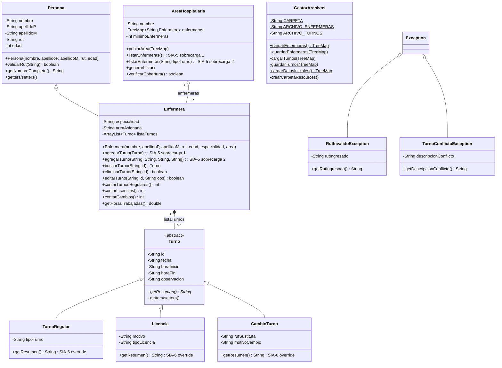

# Plan de Trabajo Completo

## Sistema de Gestión de Turnos de Enfermeras

---

## Resumen Ejecutivo

Este documento es la **guía completa de desarrollo** del Sistema de Gestión de Turnos de Enfermeras. Está diseñado para que cualquier miembro del equipo pueda leerlo y entender exactamente **qué vamos a construir, cómo, por qué y en qué orden**. El plan se basa en la experiencia del proyecto anterior (Asistencia Escolar) y cumple estrictamente la rúbrica académica SIA.

**¿Qué es el sistema?** Una aplicación de escritorio Java para asignar turnos a enfermeras en un hospital, considerando disponibilidad, preferencias y necesidades por área. Incluye gestión de cambios de turno, visualización de horarios y reportes de asistencia.

**¿Qué tecnologías usamos?** Java 11, Maven, Swing, CSV. Sin frameworks externos (Spring, Hibernate).

**¿Cuánto tiempo tomará?** Estimación: 4–6 semanas de desarrollo activo, dividido en 6 fases.

---

## Parte 1: Contexto y Restricciones

### 1.1 La Rúbrica SIA — Lo Que Debemos Cumplir Obligatoriamente

La rúbrica SIA define restricciones estrictas. A continuación, cada una con su **estrategia de cumplimiento planificada** para este proyecto:

---

#### SIA-3: Encapsulamiento, Getters/Setters y Datos de Prueba

**Qué exige:** Todos los atributos `private`, todos con getter/setter, datos iniciales hardcodeados para testing inmediato.

**Cómo lo cumpliremos:**

```java
public class Enfermera extends Persona {
    private String especialidad;          // SIEMPRE private
    private String areaAsignada;
    private ArrayList<Turno> listaTurnos; // Colección anidada (SIA-4)

    // Getter con encapsulación defensiva
    public List<Turno> getListaTurnos() {
        return Collections.unmodifiableList(listaTurnos);
    }

    // Setter con copia defensiva
    public void setListaTurnos(ArrayList<Turno> lista) {
        this.listaTurnos = new ArrayList<>(lista);
    }
}
```

**Datos semilla:** Se implementará un método `cargarDatosIniciales()` que crea al menos **5 enfermeras** con **turnos variados** (regulares, licencias, cambios), distribuidas en al menos **3 áreas hospitalarias** distintas, para que todas las funcionalidades se puedan probar inmediatamente sin ingresar datos.

---

#### SIA-4: Dos Colecciones JCF, Anidación Obligatoria, Al Menos Un Mapa

**Qué exige:** Exactamente 2 colecciones del Java Collections Framework. La segunda anidada dentro de la primera. Al menos una debe ser un Mapa. Prohibido usar arreglos primitivos.

**Cómo lo cumpliremos:**

```
COLECCIÓN 1 (Mapa):
    TreeMap<String, Enfermera> registroGlobal    ← Clave: RUT de la enfermera

COLECCIÓN 2 (Anidada dentro de cada Enfermera):
    ArrayList<Turno> listaTurnos                 ← Historial de turnos asignados
```

**¿Por qué TreeMap?** Porque mantiene las enfermeras ordenadas por RUT automáticamente (orden natural de Strings), facilitando listados y búsquedas con complejidad O(log N).

---

#### SIA-5: Sobrecarga de Métodos (Overloading) en 2 Clases

**Qué exige:** 2 clases distintas con métodos sobrecargados (mismo nombre, distintos parámetros). NO en constructores. Ambas clases deben usarse en el programa.

**Cómo lo cumpliremos:**

**Clase 1 — `AreaHospitalaria`:**
```java
// Sin parámetros: muestra todas las enfermeras del área
public void listarEnfermeras() { ... }

// Con filtro: muestra solo las enfermeras con turno de un tipo específico
public void listarEnfermeras(String tipoTurno) { ... }
```

**Clase 2 — `Enfermera`:**
```java
// Recibe objeto Turno directamente
public void agregarTurno(Turno turno) { ... }

// Recibe datos primitivos y crea el Turno internamente
public void agregarTurno(String fecha, String horaInicio, String horaFin, String tipo) { ... }
```

Ambas clases se usan efectivamente en el menú de consola y en los paneles Swing.

---

#### SIA-6: Sobreescritura de Métodos (Overriding) en 2 Clases

**Qué exige:** 2 clases que usen `@Override` en métodos. Ambas deben usarse en la ejecución.

**Cómo lo cumpliremos:**

La clase abstracta `Turno` declara:
```java
public abstract String getResumen();
```

**Clase 1 — `TurnoRegular`:**
```java
@Override
public String getResumen() {
    return "Turno " + tipoTurno + " el dia " + getFecha()
         + " de " + getHoraInicio() + " a " + getHoraFin();
}
```

**Clase 2 — `Licencia`:**
```java
@Override
public String getResumen() {
    return "Licencia " + tipoLicencia + " el dia " + getFecha()
         + ". Motivo: " + motivo;
}
```

**Clase 3 (extra) — `CambioTurno`:**
```java
@Override
public String getResumen() {
    return "Cambio de turno el dia " + getFecha()
         + ". Sustituta: " + rutSustituta + ". Motivo: " + motivoCambio;
}
```

> [!NOTE]
> Se implementan 3 clases con Override aunque solo se requieren 2, para dar más riqueza al sistema.

---

#### SIA-7, SIA-8 y SIA-9: CRUD para Ambas Colecciones + Filtro

**Qué exige:** Menú con Agregar, Listar, Buscar, Editar y Eliminar para AMBAS colecciones (la externa y la anidada), en opciones SEPARADAS. Al menos 1 filtro funcional.

**Cómo lo cumpliremos — Diseño del Menú:**

```
╔═══════════════════════════════════════════════╗
║    SISTEMA DE GESTION DE TURNOS               ║
╠═══════════════════════════════════════════════╣
║  ENFERMERAS (Colección 1):                    ║
║   1. Agregar Enfermera                        ║
║   2. Listar Enfermeras                        ║
║   3. Buscar Enfermera por RUT                 ║
║   4. Editar Enfermera                         ║
║   5. Eliminar Enfermera                       ║
╠═══════════════════════════════════════════════╣
║  TURNOS (Colección 2):                        ║
║   6. Registrar Turno                          ║
║   7. Ver Historial de Turnos                  ║
║   8. Buscar Turno por ID                      ║
║   9. Editar Observación de Turno              ║
║  10. Eliminar Turno                           ║
╠═══════════════════════════════════════════════╣
║  REPORTES Y FILTROS:                          ║
║  11. Asignación Grupal de Turnos por Área     ║
║  12. Enfermeras con exceso de turnos noche    ║  ← FILTRO (SIA-9)
║  13. Resumen por Área Hospitalaria            ║
╠═══════════════════════════════════════════════╣
║  SISTEMA:                                     ║
║   0. Guardar y Salir                          ║
╚═══════════════════════════════════════════════╝
```

**Filtro planificado (opción 12):** El usuario ingresa un número máximo de turnos noche por mes, y el sistema lista las enfermeras que superan ese límite. Similar al filtro de "alumnos con exceso de inasistencias" del proyecto anterior.

---

#### SIA-10: Doble Interfaz (Consola + Ventana)

**Qué exige:** Todas las funcionalidades en consola Y en ventanas gráficas. Selección dinámica al iniciar.

**Cómo lo cumpliremos:**

```java
public static void main(String[] args) {
    // Cargar datos (SIA-11: Persistencia Batch)
    registroGlobal = GestorArchivos.cargarEnfermeras();

    System.out.println("Sistema de Gestion de Turnos de Enfermeras");
    System.out.println("1. Modo Interfaz Grafica (Ventana)");
    System.out.println("2. Modo Consola");
    System.out.print("Opcion: ");

    int modo = leerEntero();
    if (modo == 1) {
        EventQueue.invokeLater(() -> new Ventana().setVisible(true));
    } else {
        // Entrar al loop del menú de consola
        menuConsola();
    }
}
```

---

#### SIA-11: Persistencia Batch en CSV

**Qué exige:** Cargar todo a memoria al inicio, guardar todo al salir. Formato: texto, CSV, Excel o DBMS local.

**Cómo lo cumpliremos:**

Usaremos **CSV con delimitador `;`** (misma estrategia exitosa del proyecto anterior).

**Archivo `enfermeras.csv`:**
```
RUT;Nombre;ApellidoP;ApellidoM;Edad;Especialidad;Area
12345678-5;María;González;Rojas;32;Enfermería General;UCI
22222222-2;Carlos;Muñoz;Soto;28;Urgencias;Urgencias
```

**Archivo `turnos.csv`:**
```
RUT;TIPO;ID;FECHA;HORA_INICIO;HORA_FIN;OBSERVACION;DATO_EXTRA
12345678-5;REGULAR;T001;06/09/2026;07:00;15:00;Sin novedad;Mañana
12345678-5;LICENCIA;T002;07/09/2026;;;Reposo médico;Médica
22222222-2;CAMBIO;T003;08/09/2026;15:00;23:00;Intercambio;11111111-1|Motivo personal
```

**Notas sobre el formato:**
- `DATO_EXTRA` para `REGULAR` = tipo de turno (Mañana/Tarde/Noche)
- `DATO_EXTRA` para `LICENCIA` = tipo de licencia (Médica/Personal/Maternidad)
- `DATO_EXTRA` para `CAMBIO` = `RUT_sustituta|motivo_cambio` separados por `|`
- Las licencias no tienen hora de inicio/fin (campos vacíos)

**Ciclo de persistencia:**
1. `Main.main()` → `GestorArchivos.cargarEnfermeras()` (lee ambos CSV)
2. Si no existen los CSV → `cargarDatosIniciales()` (datos hardcodeados)
3. Al salir: `GestorArchivos.guardarEnfermeras(registroGlobal)` (sobreescribe ambos CSV)
4. En GUI: `WindowAdapter.windowClosing` invoca el guardado automáticamente

---

#### SIA-12: 2 Excepciones Personalizadas con try-catch

**Qué exige:** 2 excepciones propias (heredando Exception o RuntimeException). Uso de try-catch en todo el programa.

**Cómo lo cumpliremos:**

| Excepción | Hereda de | Campo | Se lanza cuando... |
|:---|:---|:---|:---|
| `RutInvalidoException` | `Exception` | `String rutIngresado` | El RUT no pasa validación Módulo 11 |
| `TurnoConflictoException` | `Exception` | `String descripcionConflicto` | Se intenta asignar un turno que se superpone con otro existente |

**Ejemplo de uso:**
```java
// En Enfermera.agregarTurno():
public void agregarTurno(Turno nuevoTurno) throws TurnoConflictoException {
    for (Turno existente : listaTurnos) {
        if (existente.getFecha().equals(nuevoTurno.getFecha())
            && hayConflictoHorario(existente, nuevoTurno)) {
            throw new TurnoConflictoException(
                "La enfermera ya tiene turno de "
                + existente.getHoraInicio() + " a " + existente.getHoraFin()
                + " el dia " + nuevoTurno.getFecha());
        }
    }
    listaTurnos.add(nuevoTurno);
}
```

---

## Parte 2: Diseño Técnico Completo

### 2.1 Estructura de Paquetes del Proyecto

```
TurnosEnfermeria/                              ← Raíz del repositorio
├── .gitignore
├── Ejecutar.sh
├── Ejecutar.bat
├── README.md
└── Proyecto/                                  ← Proyecto Maven
    ├── pom.xml
    ├── resources/                             ← Datos CSV (fuera de src/)
    │   ├── enfermeras.csv
    │   └── turnos.csv
    └── src/main/java/TurnosEnfermeria/
        ├── Main.java                          ← Punto de entrada + menú CLI
        ├── modelo/
        │   ├── Persona.java                   ← Clase base (nombre, rut, edad)
        │   ├── Enfermera.java                 ← extends Persona + ArrayList<Turno>
        │   ├── Turno.java                     ← abstract + getResumen()
        │   ├── TurnoRegular.java              ← extends Turno (@Override)
        │   ├── Licencia.java                  ← extends Turno (@Override)
        │   ├── CambioTurno.java               ← extends Turno (@Override)
        │   ├── AreaHospitalaria.java           ← Agrupador + sobrecarga
        │   ├── GestorArchivos.java            ← Persistencia Batch CSV
        │   ├── Utilidades.java                ← Validar fechas, horas
        │   ├── RutInvalidoException.java      ← Excepción personalizada 1
        │   └── TurnoConflictoException.java   ← Excepción personalizada 2
        ├── controlador/
        │   ├── EnfermeraControlador.java      ← CRUD enfermeras
        │   └── TurnoControlador.java          ← CRUD turnos + sobrecarga
        └── vista/
            ├── Ventana.java                   ← JFrame + CardLayout + Stack
            ├── Menu.java                      ← Panel de botones
            ├── IngresoEnfermera.java           ← Formulario para agregar
            ├── PanelGestionEnfermeras.java     ← Tabla + CRUD enfermeras
            ├── PanelTurnos.java               ← Tabla + CRUD turnos
            ├── PanelAsignacionGrupal.java      ← Asignación masiva por área
            ├── PanelEstadisticasEnfermera.java ← Stats individuales
            ├── PanelGraficoArea.java           ← Gráfico de barras (Java2D)
            ├── PanelGraficoEnfermera.java      ← Gráfico de torta (Java2D)
            └── PanelResumenArea.java           ← Tabla resumen + exportar
```

### 2.2 Diagrama de Clases Completo



### 2.3 Configuración Maven (`pom.xml`)

```xml
<?xml version="1.0" encoding="UTF-8"?>
<project xmlns="http://maven.apache.org/POM/4.0.0">
    <modelVersion>4.0.0</modelVersion>
    <groupId>com.hospital</groupId>
    <artifactId>TurnosEnfermeria</artifactId>
    <version>1.0-SNAPSHOT</version>
    <packaging>jar</packaging>
    <properties>
        <maven.compiler.source>11</maven.compiler.source>
        <maven.compiler.target>11</maven.compiler.target>
        <project.build.sourceEncoding>UTF-8</project.build.sourceEncoding>
    </properties>
    <!-- SIN DEPENDENCIAS EXTERNAS: solo JDK nativo -->
    <build>
        <plugins>
            <plugin>
                <groupId>org.apache.maven.plugins</groupId>
                <artifactId>maven-jar-plugin</artifactId>
                <version>3.3.0</version>
                <configuration>
                    <archive>
                        <manifest>
                            <mainClass>TurnosEnfermeria.Main</mainClass>
                        </manifest>
                    </archive>
                </configuration>
            </plugin>
        </plugins>
    </build>
</project>
```

### 2.4 Áreas Hospitalarias Predefinidas

Similar al array `listaCursos` del proyecto anterior:

```java
public static String[] listaAreas = {
    "UCI", "Urgencias", "Pediatria", "Cirugia",
    "Maternidad", "Medicina General", "Traumatologia", "Oncologia"
};
```

### 2.5 Tipos de Turno y Horarios

```java
// Constantes en Utilidades.java o en TurnoRegular
public static final String TURNO_MANANA = "Mañana";   // 07:00 - 15:00
public static final String TURNO_TARDE  = "Tarde";    // 15:00 - 23:00
public static final String TURNO_NOCHE  = "Noche";    // 23:00 - 07:00
```

---

## Parte 3: Plan de Desarrollo Fase por Fase

### Fase 1: Configuración del Proyecto y Clases Base
**Duración:** 2-3 días | **Responsable:** Todo el equipo

#### Tareas

| # | Tarea | Descripción | Entregable |
|:---|:---|:---|:---|
| 1.1 | Crear proyecto Maven | Inicializar con `pom.xml` (ver sección 2.3), crear estructura de paquetes `modelo/`, `controlador/`, `vista/` | Proyecto que compila con `mvn clean compile` |
| 1.2 | Crear `Persona.java` | Clase base con atributos privados (nombre, apellidoP, apellidoM, rut, edad), constructor con validaciones, método `validarRut()` (Módulo 11), `getNombreCompleto()`, todos los getters/setters | Clase compilada y con Javadoc |
| 1.3 | Crear `RutInvalidoException` | Excepción checked que almacena `rutIngresado`, con getter. Se lanza desde `Persona.setRut()` | Excepción 1 de 2 (SIA-12) |
| 1.4 | Crear `TurnoConflictoException` | Excepción checked que almacena `descripcionConflicto`, con getter | Excepción 2 de 2 (SIA-12) |
| 1.5 | Crear `Turno.java` (abstracta) | Atributos: id, fecha, horaInicio, horaFin, observacion. Método abstracto `getResumen()`. Getters/setters. | Base para herencia (SIA-6) |
| 1.6 | Crear `Utilidades.java` | Métodos estáticos: `validarFecha(String)`, `validarHora(String)`, `compararFechas(String, String)` | Utilidades centralizadas |
| 1.7 | Configurar `.gitignore` | Ignorar: `target/`, `*.class`, `.idea/`, `*.iml`, `.DS_Store`, `out/`, `*.csv` | Repositorio limpio |

#### Criterios de aceptación
- [ ] `mvn clean compile` pasa sin errores
- [ ] Todos los atributos son `private` (verificar visualmente)
- [ ] `Persona` valida RUT con Módulo 11 y lanza `RutInvalidoException`
- [ ] `Turno` es abstracta con `getResumen()` abstracto

---

### Fase 2: Entidades del Dominio y Colecciones JCF
**Duración:** 3-4 días | **Responsable:** Desarrolladores del Modelo

#### Tareas

| # | Tarea | Descripción | Entregable | SIA |
|:---|:---|:---|:---|:---|
| 2.1 | Crear `TurnoRegular.java` | Extiende `Turno`. Campo: `tipoTurno` (Mañana/Tarde/Noche). `@Override getResumen()` | Subclase 1 | SIA-6 |
| 2.2 | Crear `Licencia.java` | Extiende `Turno`. Campos: `motivo`, `tipoLicencia`. `@Override getResumen()` | Subclase 2 | SIA-6 |
| 2.3 | Crear `CambioTurno.java` | Extiende `Turno`. Campos: `rutSustituta`, `motivoCambio`. `@Override getResumen()` | Subclase 3 | SIA-6 |
| 2.4 | Crear `Enfermera.java` | Extiende `Persona`. Campos: `especialidad`, `areaAsignada`, `ArrayList<Turno> listaTurnos`. CRUD de turnos con validación de conflictos. Sobrecarga de `agregarTurno()` (2 versiones). Getter con `Collections.unmodifiableList()`. Setter con copia defensiva. | Entidad principal con colección anidada | SIA-4, SIA-5 |
| 2.5 | Crear `AreaHospitalaria.java` | Campos: `nombre`, `TreeMap<String, Enfermera>`, `minimoEnfermeras`. Sobrecarga de `listarEnfermeras()` (2 versiones). Método `verificarCobertura()`. | Agrupador | SIA-5 |

#### Criterios de aceptación
- [ ] `Enfermera` contiene `ArrayList<Turno>` (colección anidada — SIA-4)
- [ ] `AreaHospitalaria` contiene `TreeMap<String, Enfermera>` (mapa — SIA-4)
- [ ] 2 clases con sobrecarga de métodos (no constructores) — SIA-5
- [ ] 2+ clases con `@Override getResumen()` — SIA-6
- [ ] `agregarTurno()` lanza `TurnoConflictoException` si hay conflicto horario
- [ ] Getters de colecciones retornan vistas inmutables

---

### Fase 3: Persistencia Batch y Datos Semilla
**Duración:** 2-3 días | **Responsable:** Desarrollador de persistencia

#### Tareas

| # | Tarea | Descripción | Entregable | SIA |
|:---|:---|:---|:---|:---|
| 3.1 | Crear `GestorArchivos.java` | Constantes: `CARPETA`, `ARCHIVO_ENFERMERAS`, `ARCHIVO_TURNOS`. Método `crearCarpetaResources()`. | Estructura base de I/O | SIA-11 |
| 3.2 | Implementar `cargarEnfermeras()` | Leer `enfermeras.csv` con `BufferedReader` + UTF-8. Parsear líneas con `split(";")`. Manejar RUT inválido y edad inválida con try-catch (no crashear, saltar la línea). Si el archivo no existe, llamar a `cargarDatosIniciales()`. | Carga funcional | SIA-11 |
| 3.3 | Implementar `cargarTurnos()` | Leer `turnos.csv`. Detectar tipo (REGULAR/LICENCIA/CAMBIO) y crear el subtipo correcto con `instanceof`-inverso. Asociar cada turno al `Estudiante` correcto por RUT. | Carga de turnos | SIA-11 |
| 3.4 | Implementar `guardarEnfermeras()` y `guardarTurnos()` | Escribir con `BufferedWriter` + UTF-8. Iterar el TreeMap, para cada enfermera escribir sus datos, luego iterar sus turnos detectando el subtipo con `instanceof`. | Guardado funcional | SIA-11 |
| 3.5 | Implementar `cargarDatosIniciales()` | Crear 5+ enfermeras hardcodeadas con turnos variados en 3+ áreas. **DEBE permitir probar TODAS las funcionalidades sin ingresar datos.** | Datos semilla | SIA-3 |

#### Criterios de aceptación
- [ ] Al eliminar la carpeta `resources/` y ejecutar, se regeneran automáticamente los datos semilla
- [ ] Al cerrar y reabrir, los datos persisten correctamente
- [ ] CSV con líneas corruptas no crashean el programa (se saltan con `System.err`)
- [ ] Los 3 tipos de turno se serializan y deserializan correctamente

---

### Fase 4: Controladores (MVC Real)
**Duración:** 1-2 días | **Responsable:** Desarrollador de controladores

> [!IMPORTANT]
> **Lección del proyecto anterior:** Los controladores se crearon pero NUNCA se usaron. Las vistas accedían directamente a `Main.listaGlobal`. **En este proyecto, los controladores DEBEN ser los únicos que tocan la colección global.** Ninguna clase de `vista/` puede importar `Main.registroGlobal`.

#### Tareas

| # | Tarea | Descripción |
|:---|:---|:---|
| 4.1 | Crear `EnfermeraControlador.java` | Métodos estáticos: `obtener(String rut)`, `agregar(Enfermera)`, `eliminar(String rut)`, `editar(String rut, String nombre, ...)`, `listar()`. Todos acceden a `Main.registroGlobal`. |
| 4.2 | Crear `TurnoControlador.java` | Métodos estáticos: `registrar(Enfermera, Turno)`, `eliminar(Enfermera, String id)`, `buscar(Enfermera, String id)`, `buscarTurno(String id)` (sobrecarga que busca en todas las enfermeras), `buscarTurno(String rut, String id)` (busca en una enfermera específica). |

#### Criterios de aceptación
- [ ] Los controladores compilan y funcionan como intermediarios
- [ ] Verificar con `grep` que ningún archivo de `vista/` importa `Main.registroGlobal` directamente

---

### Fase 5: Interfaz de Consola (CLI)
**Duración:** 3-4 días | **Responsable:** Desarrollador de consola

#### Tareas

| # | Tarea | Descripción | SIA |
|:---|:---|:---|:---|
| 5.1 | Crear menú principal en `Main.java` | Menú iterativo con `Scanner`, 14 opciones (0-13), secciones separadas visualmente | SIA-7, SIA-8 |
| 5.2 | CRUD Enfermeras (opciones 1-5) | Agregar (con selección de área y especialidad), Listar, Buscar por RUT, Editar, Eliminar. Todo con try-catch. | SIA-7 |
| 5.3 | CRUD Turnos (opciones 6-10) | Registrar (selección de tipo, fecha, hora), Ver historial, Buscar por ID, Editar observación, Eliminar. Todo con try-catch. | SIA-8 |
| 5.4 | Filtro funcional (opción 12) | Solicitar máximo de turnos noche por mes, listar enfermeras que excedan el límite | SIA-9 |
| 5.5 | Asignación grupal (opción 11) | Seleccionar área y fecha, mostrar lista de enfermeras del área, asignar turno en lote | Funcionalidad avanzada |
| 5.6 | Resumen por área (opción 13) | Mostrar tabla resumen con estadísticas de cada enfermera de un área | Funcionalidad avanzada |
| 5.7 | Guardar y salir (opción 0) | Llamar a `GestorArchivos.guardarEnfermeras()` y terminar | SIA-11 |

#### Criterios de aceptación
- [ ] TODAS las operaciones CRUD funcionan para enfermeras Y turnos
- [ ] TODAS las excepciones son capturadas con try-catch (nunca se ve un stacktrace)
- [ ] El filtro funciona correctamente
- [ ] Ingresar letras donde se espera un número no crashea el programa

---

### Fase 6: Interfaz Gráfica (Swing GUI)
**Duración:** 4-5 días | **Responsable:** Desarrollador(es) de GUI

#### Tareas

| # | Tarea | Descripción |
|:---|:---|:---|
| 6.1 | Crear `Ventana.java` | `JFrame` con `CardLayout` + `Stack<String>` para navegación con historial. `WindowAdapter.windowClosing` para persistencia. |
| 6.2 | Crear `Menu.java` | Panel con botones estilizados para cada funcionalidad |
| 6.3 | Crear `IngresoEnfermera.java` | Formulario: campos de texto + `JComboBox` para área y especialidad. Validación con `JOptionPane` |
| 6.4 | Crear `PanelGestionEnfermeras.java` | `JTable` con columnas [RUT, Nombre, Apellido, Especialidad, Área]. Botones: Buscar, Editar, Eliminar. |
| 6.5 | Crear `PanelTurnos.java` | Input de RUT, `JTable` con columnas [ID, Tipo, Fecha, Horario, Resumen]. Botones: Registrar, Editar, Eliminar. |
| 6.6 | Crear `PanelAsignacionGrupal.java` | `JComboBox` de áreas, tabla de enfermeras con checkboxes, campos de fecha y tipo de turno, botón registrar en lote. |
| 6.7 | Crear `PanelEstadisticasEnfermera.java` | Estadísticas: turnos regulares, licencias, cambios, total horas, distribución por tipo. Alerta visual si cobertura insuficiente. |
| 6.8 | Crear `PanelGraficoArea.java` | Gráfico de barras Java2D: porcentaje de cobertura por área. Barras verdes (≥ mínimo) y rojas (< mínimo). |
| 6.9 | Crear `PanelGraficoEnfermera.java` | Gráfico de torta Java2D: distribución de tipos de turno por enfermera. |
| 6.10 | Crear `PanelResumenArea.java` | `JTable` con `TableRowSorter` + botón exportar a CSV (`JFileChooser`). |

> [!CAUTION]
> **No repetir el error del proyecto anterior:** Verificar que CADA panel creado esté registrado en `Ventana.java` con `panelContenedor.add(panel, "nombreClave")` y que el botón correspondiente del menú invoque `ventana.cambiarVista("nombreClave")`.

#### Criterios de aceptación
- [ ] Todas las funcionalidades del menú CLI tienen equivalente en GUI
- [ ] Cada botón del menú navega al panel correcto (verificar uno por uno)
- [ ] Las vistas usan controladores (NO acceden a `Main.registroGlobal`)
- [ ] Cerrar la ventana guarda los datos automáticamente
- [ ] Los errores se muestran con `JOptionPane`, no con excepciones al usuario

---

## Parte 4: Verificación y Entrega

### Checklist Pre-Entrega — Cumplimiento SIA

| Código | Verificación | ✓ |
|:---|:---|:---|
| **SIA-3** | ¿Todos los atributos son `private`? Buscar con `grep -rn "public.*=\|protected" --include="*.java" src/` | ☐ |
| **SIA-3** | ¿Todos los atributos tienen getter y setter? | ☐ |
| **SIA-3** | ¿Los datos semilla permiten probar TODAS las funcionalidades sin ingresar datos? | ☐ |
| **SIA-4** | ¿Hay exactamente 2 colecciones JCF (TreeMap y ArrayList)? ¿La segunda está anidada? ¿No se usan arreglos primitivos para datos? | ☐ |
| **SIA-5** | ¿Hay 2 clases con métodos sobrecargados (NO constructores)? ¿Ambas se usan en el programa? | ☐ |
| **SIA-6** | ¿Hay 2+ clases con `@Override`? ¿Ambas se usan en la ejecución? | ☐ |
| **SIA-7/8** | ¿El CRUD está completo (Agregar, Listar, Buscar, Editar, Eliminar) para AMBAS colecciones en opciones SEPARADAS del menú? | ☐ |
| **SIA-9** | ¿Existe al menos 1 filtro funcional que procesa un subconjunto de datos? | ☐ |
| **SIA-10** | ¿Al iniciar se puede elegir Consola o Ventana? ¿TODAS las funcionalidades están en ambas interfaces? | ☐ |
| **SIA-11** | ¿Los datos se cargan al inicio y se guardan al salir (batch)? | ☐ |
| **SIA-12** | ¿Hay 2 excepciones personalizadas que heredan de Exception/RuntimeException? ¿Se usan en la lógica del programa? ¿Todo está en try-catch? | ☐ |

### Checklist de Calidad (Lecciones Aprendidas)

| Verificación | ✓ |
|:---|:---|
| ¿Ninguna vista importa ni accede directamente a `Main.registroGlobal`? | ☐ |
| ¿TODOS los paneles de la GUI están registrados en `Ventana.java`? | ☐ |
| ¿No hay validaciones duplicadas entre Vista y Modelo? (usar `Utilidades`) | ☐ |
| ¿No hay dependencias en `pom.xml` que no se usen en el código? | ☐ |
| ¿No hay código comentado ni código muerto? | ☐ |
| ¿Los scripts `.sh` tienen terminaciones de línea Unix (LF)? | ☐ |
| ¿Los scripts `.sh` y `.bat` envuelven rutas en comillas dobles? | ☐ |
| ¿Los comentarios no tienen acentos problemáticos? | ☐ |

---

## Parte 5: Riesgos y Mitigaciones

| # | Riesgo | Probabilidad | Impacto | Mitigación |
|:---|:---|:---|:---|:---|
| 1 | Controladores no usados por las vistas (repetir error anterior) | Alta | Media | Revisión de código con `grep`: ningún archivo de `vista/` debe importar `Main`. |
| 2 | Panel GUI no registrado en CardLayout | Media | Alta | Hacer click en CADA botón del menú y verificar que navega correctamente antes de entregar. |
| 3 | Validación duplicada entre Modelo y Vista | Media | Media | Regla: TODA validación va en `Utilidades` o en el Modelo. Las vistas NUNCA validan directamente. |
| 4 | CRUD incompleto para una de las colecciones | Media | Alta | Usar la tabla del menú (sección SIA-7/8) como checklist: marcar cada operación cuando esté implementada y probada. |
| 5 | Excepciones no capturadas | Media | Alta | Buscar con `grep -rn "throws" --include="*.java"` y verificar que cada `throws` tiene un `try-catch` correspondiente en la capa superior. |
| 6 | Scripts fallan por paths con espacios o CRLF | Media | Baja | Probar en un directorio con espacios en el nombre. Ejecutar `file Ejecutar.sh` para verificar line endings. |
| 7 | Datos semilla insuficientes para probar todas las funcionalidades | Baja | Alta | Los datos semilla deben cubrir: 5+ enfermeras, 3+ áreas, 3 tipos de turno, al menos 1 enfermera que supere el filtro. |

---

## Parte 6: Preguntas Pendientes para el Equipo

> [!IMPORTANT]
> Resolver estas preguntas antes de empezar a codificar para evitar retrabajo.

1. **¿Cuántos miembros tiene el equipo?** Esto define cómo dividir las fases (quién hace el Modelo, quién la GUI, etc.).

2. **¿El RUT sigue siendo el identificador?** ¿O las enfermeras se identifican con cédula profesional o matrícula?

3. **¿Los turnos son fijos de 8 horas?** (Mañana 07-15, Tarde 15-23, Noche 23-07) ¿O pueden ser variables?

4. **¿Cuáles son las áreas hospitalarias definitivas?** Propuesta: UCI, Urgencias, Pediatría, Cirugía, Maternidad, Medicina General, Traumatología, Oncología.

5. **¿El cambio de turno requiere verificar que la enfermera sustituta exista y esté disponible?** ¿O es solo un registro informativo?

6. **¿Hay fecha de entrega?** Para ajustar el ritmo de las fases.

7. **¿El filtro (SIA-9) que propusimos es adecuado?** ("enfermeras con exceso de turnos noche") ¿O prefieren otro filtro más relevante para el dominio?
