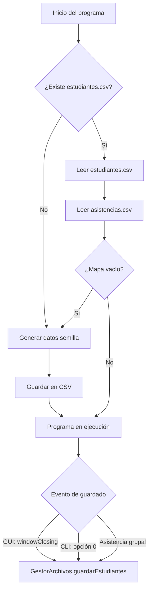
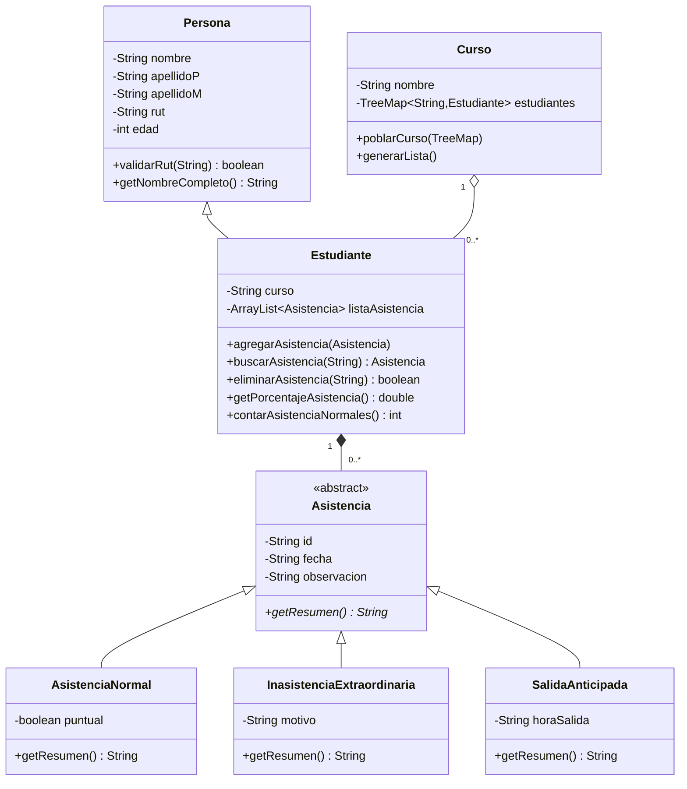

# Documento de Traspaso de Conocimiento

## Sistema de Asistencia Escolar → Sistema de Gestión de Turnos de Enfermeras

---

## Resumen Ejecutivo

El proyecto anterior — **Sistema de Asistencia Escolar** — es una aplicación de escritorio Java 11 con arquitectura MVC, doble interfaz (consola CLI + Swing GUI), persistencia en archivos CSV con delimitador `;`, validaciones de dominio chileno (RUT Módulo 11), jerarquía polimórfica de registros de asistencia, gráficos Java2D personalizados, y gestión robusta de errores mediante excepciones checked personalizadas. El sistema fue desarrollado como proyecto académico para la asignatura SIA (Sistemas de Información Avanzada) y cumple con una rúbrica de ~15 requisitos técnicos. Este documento captura exhaustivamente toda la arquitectura, convenciones, decisiones de diseño y lecciones aprendidas para replicarlas en el nuevo proyecto de **Gestión de Turnos de Enfermeras**.

---

## 1. Arquitectura y Patrones de Diseño

### 1.1 Patrón MVC (Model-View-Controller)

La estructura del proyecto sigue una separación física en paquetes:

```
AsistenciaCurso/
├── Main.java                    ← Punto de entrada + menú CLI
├── modelo/                      ← Entidades, validaciones, persistencia, utilidades
│   ├── Persona.java             ← Clase base abstracta con validación de RUT
│   ├── Estudiante.java          ← Hereda de Persona, contiene ArrayList<Asistencia>
│   ├── Asistencia.java          ← Clase abstracta con método polimórfico getResumen()
│   ├── AsistenciaNormal.java    ← extends Asistencia (campo: boolean puntual)
│   ├── InasistenciaExtraordinaria.java ← extends Asistencia (campo: String motivo)
│   ├── SalidaAnticipada.java    ← extends Asistencia (campo: String horaSalida)
│   ├── Curso.java               ← Agrupador de estudiantes por nivel
│   ├── GestorArchivos.java      ← Persistencia CSV (DAO simplificado)
│   ├── Utilidades.java          ← Validación de fechas, comparación de fechas
│   ├── EdadInvalidaException.java
│   ├── RutInvalidoException.java
│   └── EstudianteNoEncontradoException.java
├── controlador/
│   ├── EstudianteControlador.java
│   ├── AsistenciaControlador.java
│   └── CursoControlador.java
└── vista/
    ├── Ventana.java             ← JFrame principal con CardLayout
    ├── Menu.java                ← Panel de menú principal
    ├── IngresoEstudiante.java
    ├── PanelGestionEstudiantes.java
    ├── PanelAsistencias.java
    ├── PanelAsistenciaGrupal.java
    ├── PanelEstadisticasEstudiante.java
    ├── PanelGraficoCurso.java
    ├── PanelGraficoEstudiante.java
    └── PanelResumenCurso.java
```

### 1.2 Patrones de Diseño Identificados

| Patrón | Implementación | Ubicación |
|:---|:---|:---|
| **Polimorfismo (Strategy-like)** | Clase abstracta `Asistencia` con método `getResumen()` sobrescrito por 3 subclases | `modelo/Asistencia*.java` |
| **Encapsulación defensiva** | `Collections.unmodifiableList()` en getters, `new ArrayList<>(...)` en setters | `Estudiante.java`, `Curso.java` |
| **Navegación con Stack (State)** | `Stack<String> historial` para back-navigation en la GUI | `Ventana.java` |
| **DAO / Repository Lite** | `GestorArchivos` centraliza toda la I/O de archivos CSV | `modelo/GestorArchivos.java` |
| **Seed Data / Fallback** | Si no existen CSVs al inicio, se genera data semilla automáticamente | `GestorArchivos.cargarDatosIniciales()` |
| **Gráficos como Componentes** | Inner classes `GraficoBarrasPanel` y `GraficoTortaPanel` extienden `JPanel` con `paintComponent()` | `PanelGraficoCurso.java`, `PanelGraficoEstudiante.java` |
| **Sobrecarga de métodos** | `Curso.mostrarEstudiantes()` y `mostrarEstudiantes(String filtroCurso)` | `Curso.java` |

### 1.3 Arquitectura de Datos en Memoria

```
Main.listaGlobal : TreeMap<String, Estudiante>    ← RUT como clave, O(log N)
    └─ Estudiante
        ├─ extends Persona (nombre, apellidoP, apellidoM, rut, edad)
        ├─ curso : String
        └─ listaAsistencia : ArrayList<Asistencia>
            ├─ AsistenciaNormal     (id, fecha, observacion, puntual)
            ├─ InasistenciaExtraordinaria (id, fecha, observacion, motivo)
            └─ SalidaAnticipada     (id, fecha, observacion, horaSalida)
```

---

## 2. Tecnologías, Librerías y Herramientas

### 2.1 Stack Tecnológico

| Componente | Tecnología | Versión |
|:---|:---|:---|
| Lenguaje | Java | 11 |
| Build System | Apache Maven | (version del sistema) |
| Empaquetado | JAR (`maven-jar-plugin` 3.3.0) | — |
| GUI | Java Swing (javax.swing, java.awt) | Estándar JDK 11 |
| Gráficos | Java2D (`Graphics2D`) | Estándar JDK 11 |
| Persistencia | CSV con `BufferedReader`/`BufferedWriter` + `StandardCharsets.UTF_8` | — |
| Documentación | `maven-javadoc-plugin` 3.6.3 | — |
| Control de versiones | Git + GitHub | — |
| Scripts de ejecución | `Ejecutar.sh` (Linux/Mac), `Ejecutar.bat` (Windows) | — |

### 2.2 Dependencias Maven Declaradas (pero no utilizadas en código)

> [!WARNING]
> Las siguientes dependencias están en `pom.xml` pero **nunca se importan ni usan** en el código fuente. Se implementaron alternativas propias.

| Dependencia | Versión | Propósito declarado | Implementación real |
|:---|:---|:---|:---|
| `org.jfree:jfreechart` | 1.5.4 | Gráficos estadísticos (SIA-O1) | Java2D manual (`paintComponent`) |
| `org.apache.poi:poi-ooxml` | 5.3.0 | Exportación a Excel (SIA-O2) | CSV manual con `BufferedWriter` |

### 2.3 Codificación y Compilación

```xml
<maven.compiler.source>11</maven.compiler.source>
<maven.compiler.target>11</maven.compiler.target>
<project.build.sourceEncoding>UTF-8</project.build.sourceEncoding>
```

---

## 3. Convenciones de Código

### 3.1 Idioma

- **Todo en español**: nombres de clases, métodos, variables, constantes, comentarios, mensajes de UI y strings internos.
- Ejemplos: `apellidoP`, `poblarCurso()`, `contarAsistenciaNormales()`, `obtenerHistorialComoTexto()`

### 3.2 Nomenclatura

| Elemento | Convención | Ejemplo |
|:---|:---|:---|
| Clases | PascalCase, sustantivos en español | `SalidaAnticipada`, `GestorArchivos` |
| Métodos | camelCase, verbos en español | `cargarEstudiantes()`, `validarRut()` |
| Variables | camelCase, descriptivos en español | `listaAsistencia`, `apellidoP` |
| Constantes | UPPER_SNAKE_CASE | `ARCHIVO_ESTUDIANTES`, `UMBRAL` |
| Paquetes | camelCase estilo Java | `AsistenciaCurso.modelo` |
| IDs (UUID) | 8 caracteres, uppercase | `UUID.randomUUID().toString().substring(0, 8).toUpperCase()` |

### 3.3 Comentarios

- **Javadoc** en clases y métodos públicos con descripción funcional
- **Comentarios de cambio** numerados: `// CAMBIO 1:`, `// CAMBIO 2:`, etc., explicando la evolución del código
- **Referencias a rúbrica académica**: `// SIA-P1`, `// SIA-11`, `// SIA-O4`, etc.
- **Bloques explicativos** en formato `/* ... */` para formatos de datos complejos
- **Sin acentos en comentarios internos** (decisión explícita del usuario para portabilidad)

### 3.4 Formato de Código

- Llaves de apertura en la misma línea (`K&R style`)
- Indentación con 4 espacios
- Líneas en blanco entre secciones lógicas de métodos
- Agrupación de imports por paquete (`java.util`, `java.io`, luego paquetes internos)
- Sin imports wildcard explícitos en el modelo, pero sí `import AsistenciaCurso.modelo.*` en Main

### 3.5 Manejo de Errores

| Capa | Estrategia |
|:---|:---|
| **Modelo (constructores/setters)** | Fail-fast: lanza excepciones checked en validación |
| **GUI (Swing)** | `JOptionPane.showMessageDialog()` + `requestFocus()` al campo inválido |
| **CLI (consola)** | Mensaje de error + loop de reintento |
| **Persistencia (CSV)** | `System.err.println()` + saltar la línea corrupta sin detener ejecución |
| **Entrada numérica** | Retorno de valor centinela (`-1`) en `leerEntero()` |

---

## 4. Persistencia y Formatos de Datos

### 4.1 Formato CSV

**Delimitador:** `;` (punto y coma)  
**Codificación:** UTF-8 explícito  
**Sin línea de encabezado**

#### `estudiantes.csv`
```
RUT;Nombre;ApellidoPaterno;ApellidoMaterno;Edad;Curso
10101010-4;Isabel;Ortiz;Navarro;9;4 Basico
```

#### `asistencias.csv`
```
RUT;TIPO;ID;FECHA;OBSERVACION;CAMPO_ESPECIFICO
10101010-4;NORMAL;B405;06/05/2026;Presente;true
11111111-1;INASISTENCIA;A003;06/05/2026;No asiste;Certificado médico
10101010-4;SALIDA;B404;05/05/2026;Control dental;09:45
```

### 4.2 Ciclo de Vida de Datos



### 4.3 Estructura de Archivos en Disco

```
proyectoAsistenciaEscolar/
├── Proyecto/
│   ├── resources/          ← Directorio de datos (creado automáticamente)
│   │   ├── estudiantes.csv
│   │   └── asistencias.csv
│   ├── pom.xml
│   └── src/main/java/...
├── Ejecutar.sh
├── Ejecutar.bat
├── README.md
├── .gitignore
├── Manual de Usuario.pdf
└── informe.pdf
```

---

## 5. Interfaz de Usuario

### 5.1 Doble Interfaz

El sistema ofrece selección de modo al iniciar:
1. **Modo GUI (Swing):** Ventana principal con `CardLayout` y navegación por stack
2. **Modo CLI (consola):** Menú numérico con 13 opciones (0–12)

### 5.2 Arquitectura GUI

- **Single-Window:** Un `JFrame` (`Ventana`) con múltiples `JPanel` como tarjetas
- **Navegación:** `CardLayout` + `Stack<String>` para historial tipo browser
- **Paleta de colores:**
  - Headers: `#37415A` (dark slate blue)
  - Fondo: `#F5F5FA` (light lavender)
  - Botones: `#5A82C8` (blue), texto blanco
  - Alertas: `#B41E1E` (rojo < 85%), `#00823C` (verde ≥ 85%)
- **Tipografía:** Segoe UI en botones del menú
- **Tablas:** `JTable` con `DefaultTableModel` no editable + `TableRowSorter`
- **Gráficos custom:**
  - Barras: porcentaje de asistencia por alumno en un curso (azul/rojo según umbral 85%)
  - Torta: distribución de tipos de asistencia por alumno

### 5.3 Constante de Negocio

```java
private static final double UMBRAL = 85.0; // Porcentaje mínimo de asistencia
```
- Se usa en estadísticas individuales y gráficos para colorear alertas

---

## 6. Validaciones de Dominio

### 6.1 Validación de RUT Chileno (Módulo 11)

```
Algoritmo: Limpia puntos/guiones → Verifica longitud [2,12] → Extrae dígitos + verificador
→ Suma ponderada con factores 2,3,4,5,6,7 (derecha a izquierda, cíclico)
→ Módulo 11 → Mapeo a dígito verificador esperado → Compara con real
```

### 6.2 Validación de Fechas

- Formato estricto: `DD/MM/AAAA` con regex `\\d{2}/\\d{2}/\\d{4}`
- Validación de rangos de calendario (meses 1-12, días según mes)
- Validación de año bisiesto para febrero
- Comparación de fechas mediante conversión a entero `YYYYMMDD`

### 6.3 Excepciones Personalizadas

| Excepción | Extiende | Metadata almacenada | Cuándo se lanza |
|:---|:---|:---|:---|
| `RutInvalidoException` | `Exception` (checked) | `String rutIngresado` | RUT falla validación Módulo 11 |
| `EdadInvalidaException` | `Exception` (checked) | `int edadIngresada` | Edad ≤ 0 |
| `EstudianteNoEncontradoException` | `Exception` (checked) | `String rutBuscado` | RUT no existe en `listaGlobal` |

---

## 7. Flujo de Trabajo y Configuración

### 7.1 Git y Control de Versiones

- **Repositorio:** GitHub (`YungRodri/proyectoAsistenciaEscolar`)
- **Rama principal:** `main`
- **`.gitignore`:** Ignora `target/`, `*.class`, `.idea/`, `*.iml`, `.DS_Store`, `out/`, `*.csv`

### 7.2 Scripts de Ejecución

- `Ejecutar.sh` (Linux/Mac): Verifica `mvn`, ejecuta `mvn clean compile`, lanza con `mvn exec:java`
- `Ejecutar.bat` (Windows): Equivalente con `call mvn`

### 7.3 Estructura Maven

```xml
<groupId>com.mycompany</groupId>
<artifactId>Proyecto</artifactId>
<version>1.0-SNAPSHOT</version>
<packaging>jar</packaging>
<mainClass>AsistenciaCurso.Main</mainClass>
```

---

## 8. Lecciones Aprendidas y Problemas Resueltos

### 8.1 Problemas Encontrados

| Problema | Solución Aplicada |
|:---|:---|
| **Controladores creados pero no utilizados** | Los controladores (`EstudianteControlador`, etc.) se crearon para cumplir rúbrica SIA-O4 pero las vistas acceden directamente a `Main.listaGlobal`. **Lección:** En el nuevo proyecto, usar los controladores realmente como intermediarios. |
| **Panel no registrado en CardLayout** | `PanelEstadisticasEstudiante` se implementó pero no se registró en `Ventana.java`, dejando su botón de menú sin función. **Lección:** Verificar que todo componente creado esté conectado. |
| **Validación duplicada** | `Utilidades.validarFecha()` existe en el modelo, pero `PanelAsistenciaGrupal` reimplementa la misma lógica. **Lección:** Centralizar validaciones, no duplicar. |
| **Dependencias Maven fantasma** | JFreeChart y Apache POI declaradas pero nunca importadas. **Lección:** No declarar dependencias que no se usen, o bien usarlas. |
| **Código comentado/muerto** | `Main.java` contiene un método `agregarEstudiante()` completo comentado (líneas 135-200). **Lección:** Eliminar código muerto, confiar en git para historial. |
| **Ejecución con paths con espacios** | Los scripts `.sh` fallaban con rutas que contenían espacios. Solución: comillas dobles en todas las rutas del script. |
| **Line endings Windows/Linux** | `Ejecutar.sh` tenía `\r\n` (CRLF). Solución: `dos2unix` o `sed` para convertir. |

### 8.2 Decisiones de Diseño Clave

| Decisión | Justificación |
|:---|:---|
| **TreeMap en vez de HashMap** | Mantiene estudiantes ordenados por RUT automáticamente. O(log N) aceptable para el volumen de datos. |
| **CSV con `;` en vez de `,`** | Evita conflictos con nombres que puedan contener comas. Estándar en contextos latinoamericanos. |
| **UUID de 8 caracteres como ID** | Suficientemente único para el volumen esperado, legible en consola. |
| **Excepciones checked (no unchecked)** | Obliga al programador a manejar errores de validación explícitamente. Requisito académico. |
| **`Collections.unmodifiableList/Map`** | Previene modificación accidental de listas internas desde fuera de la entidad. |
| **Java2D manual en vez de JFreeChart** | Menor complejidad de dependencias, mayor control sobre la apariencia. |
| **Doble interfaz (CLI + GUI)** | Permite testing rápido por consola y demostración visual por GUI. |

### 8.3 Preferencias del Usuario

- **Idioma del código:** Todo en español (variables, métodos, comentarios, UI)
- **Sin acentos en comentarios internos** para evitar problemas de encoding
- **Comentarios de tipo `CAMBIO N:`** para documentar la evolución iterativa
- **Datos semilla automáticos** para que el sistema nunca arranque vacío
- **Portabilidad:** Scripts `.sh` y `.bat` para ejecución cross-platform con un doble clic

---

## 9. Métricas del Proyecto

| Métrica | Valor |
|:---|:---|
| Archivos Java | 26 |
| Líneas de código (Main.java) | 576 |
| Líneas de código (GestorArchivos.java) | 311 |
| Clases en Modelo | 10 (3 entidades, 3 excepciones, 1 DAO, 1 utilidades, 1 abstracta, 1 agrupador) |
| Clases en Vista | 10 (1 JFrame, 9 JPanel) |
| Clases en Controlador | 3 |
| Excepciones personalizadas | 3 |
| Archivos CSV de datos | 2 |
| Dependencias Maven | 2 (declaradas, no usadas) |
| Plugins Maven | 2 (jar, javadoc) |

---

## 10. Diagrama de Clases Resumido


