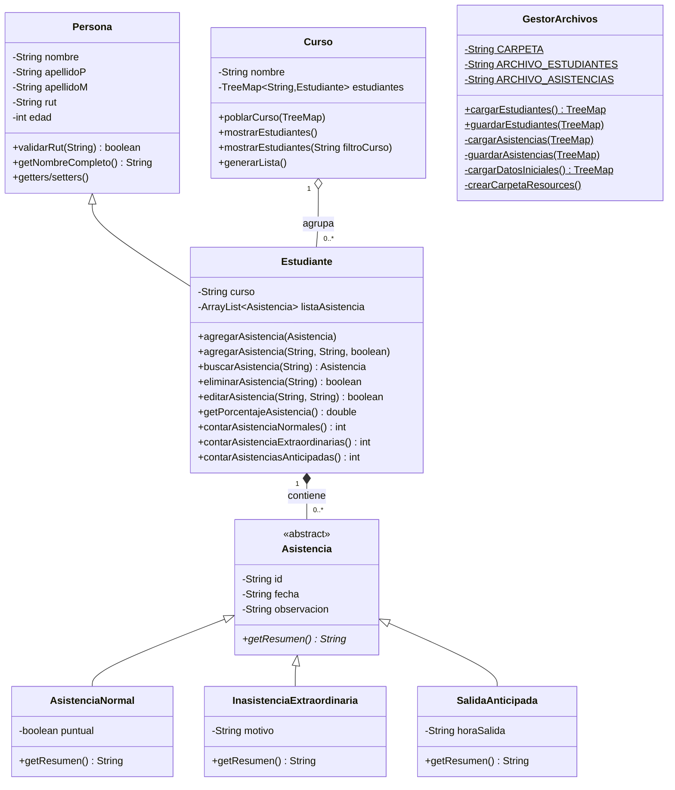
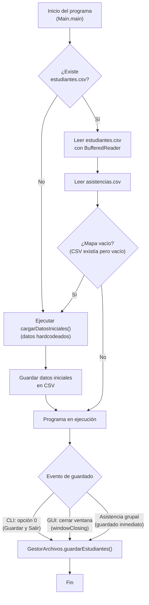

# Documento de Traspaso de Conocimiento

## De: Sistema de Asistencia Escolar → Hacia: Sistema de Gestión de Turnos de Enfermeras

---

## Resumen Ejecutivo

Este documento recoge **toda la experiencia acumulada** en el desarrollo del proyecto anterior (Sistema de Asistencia Escolar) y la organiza para que cualquier miembro del equipo pueda entender las decisiones de diseño, la arquitectura, las convenciones de código, los errores cometidos y las lecciones aprendidas. El objetivo es aplicar este conocimiento al nuevo proyecto (Gestión de Turnos de Enfermeras) sin repetir errores y manteniendo el mismo nivel de calidad, pero escribiendo el código completamente desde cero como exige la rúbrica.

Ambos proyectos comparten la misma rúbrica académica **SIA** y el mismo stack tecnológico base: **Java 11, Maven, Swing, CSV**.

---

## 1. ¿Qué era el Proyecto Anterior?

### 1.1 Descripción General

El **Sistema de Asistencia Escolar** es una aplicación de escritorio desarrollada en Java que permite:
- Registrar y gestionar alumnos de un colegio chileno (12 cursos: 1° Básico a 4° Medio)
- Registrar tres tipos de asistencia: normal (con puntualidad), inasistencia extraordinaria (con motivo) y salida anticipada (con hora de salida)
- Visualizar estadísticas y gráficos por alumno y por curso
- Exportar datos a CSV
- Funcionar tanto por consola como por interfaz gráfica Swing

### 1.2 Estructura del Proyecto en Disco

```
proyectoAsistenciaEscolar/
├── .gitignore                    ← Ignora target/, *.class, .idea/, *.csv
├── Ejecutar.sh                   ← Script de ejecución para Linux/Mac
├── Ejecutar.bat                  ← Script de ejecución para Windows
├── README.md                     ← Documentación del proyecto
├── Manual de Usuario.pdf         ← Manual para el usuario final
├── informe.pdf                   ← Informe técnico de entrega
├── LICENSE                       ← Licencia MIT
└── Proyecto/                     ← Proyecto Maven
    ├── pom.xml                   ← Configuración Maven (Java 11, UTF-8)
    ├── resources/                ← Carpeta de datos CSV (fuera de src/)
    │   ├── estudiantes.csv       ← Datos de alumnos
    │   └── asistencias.csv       ← Historial de asistencia
    └── src/main/java/AsistenciaCurso/
        ├── Main.java                              ← Punto de entrada
        ├── modelo/
        │   ├── Persona.java                       ← Clase base (nombre, rut, edad)
        │   ├── Estudiante.java                    ← extends Persona + ArrayList<Asistencia>
        │   ├── Asistencia.java                    ← Clase ABSTRACTA
        │   ├── AsistenciaNormal.java              ← extends Asistencia (puntual: boolean)
        │   ├── InasistenciaExtraordinaria.java    ← extends Asistencia (motivo: String)
        │   ├── SalidaAnticipada.java              ← extends Asistencia (horaSalida: String)
        │   ├── Curso.java                         ← Agrupador por nivel educativo
        │   ├── GestorArchivos.java                ← Persistencia CSV (carga/guarda)
        │   ├── Utilidades.java                    ← Validar fechas, comparar fechas
        │   ├── RutInvalidoException.java          ← Excepción checked personalizada
        │   ├── EdadInvalidaException.java         ← Excepción checked personalizada
        │   └── EstudianteNoEncontradoException.java ← Excepción checked personalizada
        ├── controlador/
        │   ├── EstudianteControlador.java         ← CRUD de estudiantes
        │   ├── AsistenciaControlador.java         ← CRUD de asistencias
        │   └── CursoControlador.java              ← Operaciones por curso
        └── vista/
            ├── Ventana.java                       ← JFrame principal con CardLayout
            ├── Menu.java                          ← Panel de botones del menú
            ├── IngresoEstudiante.java             ← Formulario para agregar alumno
            ├── PanelGestionEstudiantes.java       ← Tabla + CRUD de alumnos
            ├── PanelAsistencias.java              ← Tabla + CRUD de asistencias
            ├── PanelAsistenciaGrupal.java         ← Registro masivo por curso
            ├── PanelEstadisticasEstudiante.java   ← Stats individuales
            ├── PanelGraficoCurso.java             ← Gráfico de barras (Java2D)
            ├── PanelGraficoEstudiante.java        ← Gráfico de torta (Java2D)
            └── PanelResumenCurso.java             ← Tabla resumen + exportar CSV
```

**Total:** 26 archivos Java, 1 pom.xml, 2 archivos CSV, 2 scripts de ejecución.

---

## 2. Arquitectura del Sistema

### 2.1 Patrón MVC

El proyecto usa el patrón **Modelo-Vista-Controlador** separado en tres paquetes:

| Capa | Paquete | Responsabilidad |
|:---|:---|:---|
| **Modelo** | `modelo/` | Entidades de dominio, validaciones de negocio, persistencia en archivos, utilidades |
| **Vista** | `vista/` | Interfaz gráfica Swing (ventanas, paneles, tablas, gráficos) y menú de consola |
| **Controlador** | `controlador/` | Intermediarios entre Vista y Modelo (operaciones CRUD) |

### 2.2 Estructura de Datos en Memoria

La arquitectura de datos sigue este esquema (cumpliendo SIA-4):

```
Main.listaGlobal : TreeMap<String, Estudiante>     ← COLECCIÓN 1 (Mapa, clave = RUT)
    └─ Estudiante
        ├─ extends Persona
        │   ├─ nombre : String
        │   ├─ apellidoP : String
        │   ├─ apellidoM : String
        │   ├─ rut : String              ← Clave del TreeMap
        │   └─ edad : int
        ├─ curso : String
        └─ listaAsistencia : ArrayList<Asistencia>   ← COLECCIÓN 2 (Anidada)
            ├─ AsistenciaNormal      (id, fecha, observacion, puntual)
            ├─ InasistenciaExtraord. (id, fecha, observacion, motivo)
            └─ SalidaAnticipada      (id, fecha, observacion, horaSalida)
```

**¿Por qué TreeMap y no HashMap?** TreeMap mantiene los estudiantes **ordenados por RUT** automáticamente (orden natural de Strings). Esto facilita listados ordenados sin necesidad de ordenar manualmente. La complejidad O(log N) es aceptable para el volumen de datos esperado.

### 2.3 Diagrama de Clases



---

## 3. Cumplimiento de la Rúbrica SIA — Punto por Punto

### SIA-3: Encapsulamiento, Getters/Setters y Datos de Prueba

**Cómo se cumplió:**
- **TODOS** los atributos de **TODAS** las clases son `private`.
- Cada atributo tiene su getter y setter correspondiente.
- El método `GestorArchivos.cargarDatosIniciales()` crea 3 estudiantes con asistencias hardcodeadas cuando no existen los archivos CSV, permitiendo ejecutar cualquier funcionalidad inmediatamente.

**Ejemplo de datos semilla:**
```java
private static TreeMap<String, Estudiante> cargarDatosIniciales() {
    TreeMap<String, Estudiante> estudiantes = new TreeMap<>();
    try {
        Estudiante e1 = new Estudiante("Ana", "Pérez", "Soto", "12345678-5", 14, "8 Basico");
        e1.agregarAsistencia(new AsistenciaNormal("A001", "06/05/2026", "Presente", true));
        e1.agregarAsistencia(new SalidaAnticipada("A002", "07/05/2026", "Retiro", "11:30"));
        estudiantes.put(e1.getRut(), e1);
        // ... más estudiantes
    } catch (RutInvalidoException | EdadInvalidaException e) {
        System.err.println("Error en datos iniciales: " + e.getMessage());
    }
    return estudiantes;
}
```

### SIA-4: Estructuras de Datos JCF

**Cómo se cumplió:**
- **Colección 1 (Mapa):** `TreeMap<String, Estudiante> listaGlobal` en `Main.java` — almacena todos los estudiantes con RUT como clave.
- **Colección 2 (Anidada):** `ArrayList<Asistencia> listaAsistencia` dentro de cada `Estudiante` — almacena el historial de asistencias.
- No se usaron arreglos primitivos (`[]`) para datos del modelo.

### SIA-5: Sobrecarga de Métodos (2 clases)

**Cómo se cumplió:**
- **Clase 1:** `Curso` tiene `mostrarEstudiantes()` (sin parámetros, muestra todos) y `mostrarEstudiantes(String filtroCurso)` (filtra por nombre de curso).
- **Clase 2:** `Estudiante` tiene `agregarAsistencia(Asistencia asistencia)` (recibe objeto) y `agregarAsistencia(String fecha, String observacion, boolean puntual)` (recibe datos primitivos y crea el objeto internamente).

> [!IMPORTANT]
> La sobrecarga **NO puede ser en constructores** según la rúbrica. Debe ser en métodos regulares. Ambas clases con sobrecarga deben usarse efectivamente en el programa.

### SIA-6: Sobreescritura de Métodos (2 clases con @Override)

**Cómo se cumplió:**
- La clase abstracta `Asistencia` declara `public abstract String getResumen()`.
- **Clase 1:** `AsistenciaNormal` sobrescribe con `@Override` → retorna `"Vino a clases el día X y llegó temprano/tarde"`.
- **Clase 2:** `InasistenciaExtraordinaria` sobrescribe con `@Override` → retorna `"Faltó el día X. Motivo: Y"`.
- **Clase 3:** `SalidaAnticipada` también sobrescribe (3 clases cumplen, solo se requieren 2).

### SIA-7, SIA-8 y SIA-9: CRUD Completo y Filtros

**Cómo se cumplió:**

El menú de consola ofrece CRUD separado para **ambas colecciones**:

| Operación | Colección 1 (Estudiantes) | Colección 2 (Asistencias) |
|:---|:---|:---|
| **Agregar** | Opción 1: `agregarEstudiante()` | Opción 6: `registrarAsistencia()` |
| **Listar** | Opción 2: `mostrarEstudiantes()` | Opción 7: `verHistorial()` |
| **Buscar** | Opción 3: `buscarEstudiante()` | Opción 10: `buscarAsistenciaMenu()` |
| **Editar** | Opción 4: `editarEstudiante()` | Opción 8: `editarAsistenciaMenu()` |
| **Eliminar** | Opción 5: `eliminarEstudiante()` | Opción 9: `eliminarAsistenciaMenu()` |
| **Filtro** | Opción 12: Alumnos con exceso de inasistencias | — |

**Filtro implementado (SIA-9):** El usuario ingresa un número máximo de inasistencias y el sistema lista todos los alumnos que superan ese umbral.

### SIA-10: Doble Interfaz

**Cómo se cumplió:**
```java
// En Main.main():
System.out.println("1. Modo Interfaz Gráfica (Ventana)");
System.out.println("2. Modo Consola");
// Si elige 1: lanza Ventana Swing
// Si elige 2: entra al loop del menú de consola
```

Todas las funcionalidades están disponibles en **ambas interfaces**.

### SIA-11: Persistencia Batch

**Cómo se cumplió:**
- **Al iniciar:** `Main.main()` llama a `GestorArchivos.cargarEstudiantes()` que lee `estudiantes.csv` y `asistencias.csv` a memoria.
- **Al salir (consola):** La opción "0" del menú llama a `GestorArchivos.guardarEstudiantes(listaGlobal)`.
- **Al cerrar ventana (GUI):** `Ventana` registra un `WindowAdapter` en `windowClosing` que llama a `guardarEstudiantes()`.
- **Formato:** CSV con delimitador `;`, codificación UTF-8, sin línea de encabezado.

### SIA-12: Excepciones Personalizadas

**Cómo se cumplió:**

| Excepción | Hereda de | Campo almacenado | Se lanza cuando... |
|:---|:---|:---|:---|
| `RutInvalidoException` | `Exception` (checked) | `String rutIngresado` | El RUT falla la validación Módulo 11 |
| `EdadInvalidaException` | `Exception` (checked) | `int edadIngresada` | La edad es ≤ 0 |
| `EstudianteNoEncontradoException` | `Exception` (checked) | `String rutBuscado` | El RUT no existe en el mapa |

**Estrategia de manejo por capa:**

| Capa | Qué hace cuando atrapa una excepción |
|:---|:---|
| GUI (Swing) | Muestra `JOptionPane.showMessageDialog()` con el error + mueve el foco al campo inválido |
| CLI (Consola) | Imprime mensaje de error + permite reintentar |
| CSV (Persistencia) | Imprime en `System.err` + salta la línea corrupta sin detener el programa |

---

## 4. Stack Tecnológico Completo

| Componente | Tecnología | Versión | Notas |
|:---|:---|:---|:---|
| **Lenguaje** | Java SE | JDK 11 | Compatible con JDK 8 |
| **Build** | Apache Maven | Del sistema | `pom.xml` con `maven-jar-plugin` |
| **GUI** | Java Swing | Nativo JDK | `javax.swing`, `java.awt` |
| **Gráficos** | Java2D | Nativo JDK | `Graphics2D` con `paintComponent()` |
| **Persistencia** | CSV manual | — | `BufferedReader`/`BufferedWriter` + `StandardCharsets.UTF_8` |
| **IDE** | Netbeans / Eclipse / IntelliJ | — | Cualquier IDE compatible con Maven |
| **Control de versiones** | Git + GitHub | — | Repositorio privado |

**Configuración Maven (`pom.xml`):**
```xml
<properties>
    <maven.compiler.source>11</maven.compiler.source>
    <maven.compiler.target>11</maven.compiler.target>
    <project.build.sourceEncoding>UTF-8</project.build.sourceEncoding>
</properties>
```

> [!WARNING]
> En el proyecto anterior se declararon `jfreechart` y `poi-ooxml` como dependencias en el `pom.xml` pero **nunca se importaron ni usaron** en el código. Los gráficos se hicieron con Java2D puro y la exportación se hizo con CSV manual. **No repetir este error:** solo declarar dependencias que realmente se importen.

---

## 5. Convenciones de Código

### 5.1 Idioma
- **Todo en español:** nombres de clases, métodos, variables, constantes, comentarios, mensajes de UI.
- Ejemplos: `apellidoP`, `poblarCurso()`, `contarAsistenciaNormales()`, `obtenerHistorialComoTexto()`

### 5.2 Nomenclatura

| Elemento | Convención | Ejemplo |
|:---|:---|:---|
| Clases | PascalCase, sustantivos | `SalidaAnticipada`, `GestorArchivos` |
| Métodos | camelCase, verbos | `cargarEstudiantes()`, `validarRut()` |
| Variables | camelCase, descriptivos | `listaAsistencia`, `apellidoP` |
| Constantes | UPPER_SNAKE_CASE | `ARCHIVO_ESTUDIANTES`, `UMBRAL` |
| Paquetes | camelCase estilo Java | `AsistenciaCurso.modelo` |
| IDs únicos | UUID 8 chars, uppercase | `UUID.randomUUID().toString().substring(0,8).toUpperCase()` |

### 5.3 Comentarios
- **Javadoc** en clases y métodos públicos con descripción funcional.
- **Comentarios `// CAMBIO N:`** numerados para documentar la evolución del código.
- **Referencias a rúbrica:** `// SIA-4: Colección anidada`, `// SIA-5: Sobrecarga`, etc.
- **Sin acentos en comentarios internos** (decisión del equipo para evitar problemas de encoding en distintos IDEs).

### 5.4 Formato
- Llaves de apertura en la misma línea (estilo K&R): `if (...) {`
- Indentación con **4 espacios** (no tabs).
- Líneas en blanco entre secciones lógicas de métodos.
- Imports agrupados: primero `java.util`, luego `java.io`, luego paquetes internos.

### 5.5 Manejo de Errores
- **Nunca dejar que el programa crashee.** Todo código que pueda fallar debe estar en `try-catch`.
- En GUI: mostrar `JOptionPane` con mensaje amigable.
- En consola: imprimir mensaje y ofrecer reintentar.
- En persistencia: imprimir en `System.err` y saltar la línea sin abortar.
- **Nunca usar `e.printStackTrace()` en código de producción.** Usar `System.err.println()` con mensaje descriptivo.

---

## 6. Persistencia y Formatos de Datos

### 6.1 Formato CSV

- **Delimitador:** `;` (punto y coma) — evita conflictos con comas en nombres
- **Codificación:** UTF-8 explícito (`StandardCharsets.UTF_8`)
- **Sin línea de encabezado** en el archivo
- **Ubicación:** Carpeta `resources/` en la raíz del proyecto Maven

#### Archivo `estudiantes.csv`
```
RUT;Nombre;ApellidoPaterno;ApellidoMaterno;Edad;Curso
```
Ejemplo:
```
12345678-5;Ana;Pérez;Soto;14;8 Basico
11111111-1;Luis;González;Rojas;15;1 Medio
```

#### Archivo `asistencias.csv`
```
RUT;TIPO;ID;FECHA;OBSERVACION;CAMPO_ESPECIFICO
```
Donde `CAMPO_ESPECIFICO` depende del tipo:
- `NORMAL` → `"true"` o `"false"` (puntualidad)
- `INASISTENCIA` → texto del motivo
- `SALIDA` → hora de salida en formato `HH:MM`

Ejemplo:
```
12345678-5;NORMAL;A001;06/05/2026;Presente en clases;true
11111111-1;INASISTENCIA;A003;06/05/2026;No asiste;Certificado médico
12345678-5;SALIDA;B404;05/05/2026;Control dental;09:45
```

### 6.2 Ciclo de Vida de los Datos



---

## 7. Interfaz de Usuario

### 7.1 Doble Interfaz (SIA-10)

Al iniciar, el programa pregunta:
```
Sistema de Asistencia Escolar
Seleccione el modo de ejecución:
1. Modo Interfaz Gráfica (Ventana)
2. Modo Consola
Opción: _
```

### 7.2 Arquitectura de la GUI Swing

- **Una sola ventana** (`JFrame`) con múltiples paneles intercambiables via `CardLayout`.
- **Navegación por historial** usando `Stack<String>` — permite volver atrás como en un browser.
- **Guardado automático** al cerrar la ventana (`WindowAdapter.windowClosing`).

### 7.3 Paleta de Colores

| Elemento | Color | Hex |
|:---|:---|:---|
| Header/Barra superior | Dark slate blue | `#37415A` |
| Fondo general | Light lavender | `#F5F5FA` |
| Botones principales | Blue | `#5A82C8` |
| Texto de botones | Blanco | `#FFFFFF` |
| Alerta positiva (≥85%) | Verde | `#00823C` |
| Alerta negativa (<85%) | Rojo | `#B41E1E` |
| Barras de gráfico OK | Azul | `#4682C8` |
| Barras de gráfico alerta | Rojo | `#C83C3C` |

### 7.4 Gráficos con Java2D

En lugar de usar librerías externas (JFreeChart), los gráficos se renderizan manualmente:
- **Barras:** `PanelGraficoCurso.GraficoBarrasPanel` — inner class que extiende `JPanel`, sobrescribe `paintComponent(Graphics g)`, dibuja ejes, barras proporcionales, etiquetas y leyenda.
- **Torta:** `PanelGraficoEstudiante.GraficoTortaPanel` — calcula ángulos con `Math.round((count * 360.0) / total)`, dibuja arcos con `fillArc()`.

---

## 8. Lecciones Aprendidas y Errores a NO Repetir

### 8.1 Errores Críticos del Proyecto Anterior

| # | Error | Descripción | Impacto | Solución para el nuevo proyecto |
|:---|:---|:---|:---|:---|
| 1 | **Controladores no usados** | Se crearon 3 controladores (`EstudianteControlador`, etc.) para cumplir la rúbrica, pero NINGUNA vista ni el Main los invoca. Las vistas acceden directamente a `Main.listaGlobal`. | Acoplamiento directo Vista↔Modelo, MVC incompleto | **Las vistas DEBEN usar los controladores como intermediarios.** Ninguna vista puede importar ni acceder a `Main.registroGlobal` directamente. |
| 2 | **Panel no registrado** | `PanelEstadisticasEstudiante` se programó completo, pero nunca se registró en el `CardLayout` de `Ventana.java`. El botón del menú que lo invoca no hace nada. | Funcionalidad invisible al usuario | **Crear un checklist verificando que CADA panel implementado esté registrado en `Ventana` y que su botón funcione.** |
| 3 | **Validación duplicada** | `Utilidades.validarFecha()` existe en el modelo, pero `PanelAsistenciaGrupal` reimplementa la misma lógica como método privado. | Inconsistencia, mantenimiento duplicado | **Toda validación va en `Utilidades` o en el Modelo. Las vistas NUNCA reimplementan validaciones.** |
| 4 | **Dependencias Maven fantasma** | `jfreechart` y `poi-ooxml` están declaradas en `pom.xml` pero nunca se importan en el código Java. | Peso innecesario del JAR, confusión | **Solo agregar una dependencia al `pom.xml` cuando ya se tiene el `import` escrito.** |
| 5 | **Código muerto** | `Main.java` contiene un método `agregarEstudiante()` completo comentado (60+ líneas). | Ruido visual, confusión | **Jamás dejar código comentado. Confiar en Git para el historial.** |
| 6 | **Scripts con paths con espacios** | `Ejecutar.sh` fallaba si la ruta del proyecto contenía espacios. | No se podía ejecutar el proyecto | **Envolver TODAS las rutas en comillas dobles en los scripts.** |
| 7 | **Line endings CRLF** | `Ejecutar.sh` tenía terminaciones de línea Windows (`\r\n`), haciéndolo inejectable en Linux. | Script inejectable en Linux | **Verificar con `dos2unix` o `sed` antes de entregar.** |

### 8.2 Decisiones de Diseño que SÍ Funcionaron Bien

| Decisión | Justificación | Resultado |
|:---|:---|:---|
| `TreeMap` en vez de `HashMap` | Mantiene estudiantes ordenados por RUT automáticamente | Listados siempre ordenados sin código extra |
| CSV con `;` en vez de `,` | Evita conflictos con nombres que contengan comas | Cero problemas de parsing |
| UUID de 8 caracteres | Legible en consola, suficientemente único para el volumen | Nunca hubo colisiones |
| Excepciones checked | Obliga al programador a manejar errores explícitamente | Programa nunca crashea |
| `Collections.unmodifiableList/Map` | Previene modificación accidental de listas internas | Encapsulación robusta |
| Doble interfaz CLI + GUI | Testing rápido por consola, demo visual por GUI | Flexibilidad total |
| Datos semilla automáticos | El programa nunca arranca vacío | Testing inmediato |
| `WindowAdapter.windowClosing` | Guarda datos automáticamente al cerrar la ventana | Nunca se pierden datos |

---

## 9. Validaciones de Dominio

### 9.1 Validación de RUT Chileno (Módulo 11)

El método `Persona.validarRut(String rut)` implementa el algoritmo completo:
1. Limpia puntos y guiones del input
2. Verifica longitud entre 2 y 12 caracteres
3. Extrae el cuerpo numérico y el dígito verificador
4. Calcula la suma ponderada con factores `2, 3, 4, 5, 6, 7` (derecha a izquierda, cíclico)
5. Aplica módulo 11 y mapea al dígito esperado (0-9 o 'K')
6. Compara con el dígito verificador real

**Este algoritmo debe reutilizarse en el nuevo proyecto** (reescribiéndolo desde cero para cumplir la rúbrica de originalidad).

### 9.2 Validación de Fechas

`Utilidades.validarFecha(String fecha)`:
- Formato estricto `DD/MM/AAAA` validado con regex `\\d{2}/\\d{2}/\\d{4}`
- Validación de rangos: meses 1-12, días según mes
- Validación de año bisiesto para febrero
- Método auxiliar `compararFechas(String f1, String f2)` convierte a `YYYYMMDD` como entero

---

## 10. Preferencias del Equipo de Desarrollo

Estas preferencias fueron establecidas durante el desarrollo del proyecto anterior:

1. **Idioma del código:** Todo en español sin excepción
2. **Sin acentos en comentarios** para evitar problemas de encoding entre IDEs
3. **Datos semilla automáticos** para que el sistema nunca arranque vacío
4. **Portabilidad:** Scripts `.sh` y `.bat` para ejecución multiplataforma
5. **Carpeta `resources/` fuera de `src/`** para mantener los datos CSV separados del código fuente
6. **Menú de consola limpio:** secciones separadas visualmente (Estudiantes, Asistencias, Reportes, Sistema)
